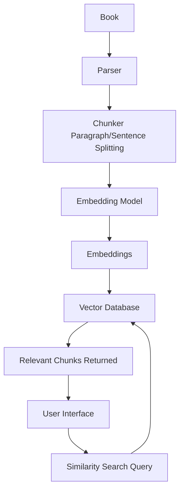

# ttrpg-wiki
Converting table top role-play game books into an easier RAG based form to make it easier to play and understand.
This is the workflow 

```mermaid
graph TD
    A[Book] --> B[Parser]
    B --> C[Chunker Paragraph/Sentence Splitting]
    C --> D[Embedding Model]
    D --> E[Embeddings]
    E --> F[Vector Database]
    G[User Interface] --> H[Similarity Search Query]
    H --> F
    F --> I[Relevant Chunks Returned]
    I --> G
```